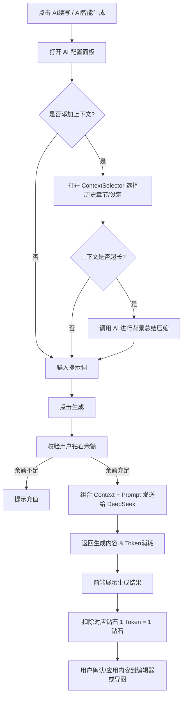

# 产品需求文档 (PRD)：AI 续写与智能生成功能

## 1. 功能概述
在“简单写作（simplechat）”平台中，“AI续写”与“AI智能生成”是最核心的创作辅助功能。该功能允许用户在正文情节创作和思维导图（作品大纲、世界设定、角色设定等）编辑过程中，通过调用大模型（当前优先使用 DeepSeek）并提供提示词，自动生成后续情节或拓展子节点。同时，为了解决长篇创作中 AI 容易“遗忘”前文设定的问题，本功能引入了**上下文引用与智能总结机制**，并配套了透明的**Token-钻石等价扣费系统**。

## 2. 目标用户与使用场景
- **网文创作者/小说作者**：在卡文或缺乏灵感时，使用 AI 续写正文情节；在构建大纲时，使用 AI 智能生成细化剧情节点或世界观。
- **核心痛点解决**：
  1. **创作瓶颈**：通过提示词快速生成文本或节点大纲，打破思路阻塞。
  2. **设定遗忘（OOM/上下文丢失）**：允许引用前文章节或角色/大纲设定，AI 在生成时能保持与前文情节、人物性格的高度一致性。
  3. **计费不透明**：将 Token 消耗与平台“钻石（星石）”1:1 挂钩，让用户对每一次 AI 调用的成本了然于心。

## 3. 核心功能详情

### 3.1 入口与触发方式
1. **正文/未命名章节页面**：
   - 在正文编辑器工具栏或悬浮菜单中提供“AI续写”按钮。
   - 点击后弹出 AI 续写配置面板。
2. **思维导图页面（作品大纲/世界设定/角色等）**：
   - 选中任一节点，点击节点旁或操作栏的“AI智能生成”按钮。
   - 点击后弹出节点 AI 生成配置面板。

### 3.2 AI 正文情节续写
- **功能描述**：根据用户输入的提示词（Prompt），调用 API Key 为当前章节生成后续情节内容。
- **操作流程**：
  1. 用户点击“AI续写”，打开面板。
  2. （可选）点击“添加上下文参考”，通过 `ContextSelectorDialog` 选择之前已写的章节或设定大纲。
  3. 输入续写要求的提示词（如：“主角在这里遇到了反派，发生了一场激烈的战斗”）。
  4. 点击发送，AI 返回生成的情节文本。
  5. 用户可选择“采纳”、“重试”或“放弃”，采纳后内容直接插入编辑器光标位置。

### 3.3 AI 思维导图智能生成
- **功能描述**：对思维导图的选定节点进行内容扩写，并能够**自动创建一系列子节点**（即为该节点生成大纲）。
- **操作流程**：
  1. 用户选中节点（如：“第一卷：初入江湖”），点击“AI智能生成”。
  2. （可选）添加相关的世界设定或前置大纲作为上下文。
  3. 输入生成要求（如：“为这一卷生成5个核心事件节点”）。
  4. AI 生成结构化的 JSON 数据，前端解析后，在当前节点下自动生成对应的子节点及子节点内容。

### 3.4 上下文引用与智能总结机制（核心亮点）
- **痛点**：用户若连续选择大量前置章节作为上下文，直接喂给模型会导致 Token 超出限制或模型注意力分散。
- **解决方案（智能总结）**：
  1. **上下文选择**：用户通过树形结构选择历史章节文本、大纲节点。
  2. **字数/Token 阈值检测**：前端或服务端统计所选上下文的总字符数。若超出设定的安全阈值（例如 3000 字），则触发**预处理阶段（Summarization）**。
  3. **总结阶段（系统自动执行）**：
     - 系统在后台静默发起一次大模型调用，提示词形如：“请提取以下章节/设定中的核心剧情、角色状态和关键设定，生成一份字数精简的背景摘要：[用户选中的超长上下文]”。
     - 提取总结后的精简文本。
  4. **最终生成阶段**：
     - 将“精简总结后的上下文” + “用户输入的提示词（Prompt）” 组合成最终的 Prompt。
     - **系统提示语（System Prompt）**需明确强调：“你是一个专业的小说续写助手。请严格参考以下背景设定与前文剧情（Context），确保新生成的情节/节点符合既有的人物性格与剧情发展逻辑，同时满足用户的具体要求（Task）。”

### 3.5 Token 与钻石（星石）计费系统
- **等价转换原则**：为了避免复杂的换算，**1 Token = 1 钻石（星石）**。
- **双维度计费**：
  - **输入消耗**：包含用户输入的 Prompt + 上下文（若经过总结，则为总结后传入的上下文 Token 数，外加总结那次 API 调用的开销，需在 UI 上合并提示或分别计算）。
  - **输出消耗**：AI 生成内容所消耗的 Token 数。
- **UI 展示要求**：
  - 在生成面板显示当前余额。
  - 每次生成完毕后，展示本次消耗账单：`本次消耗：XXX 钻石（输入 XXX，输出 XXX）`。
  - 若余额不足，拦截生成请求并引导充值。
- **模型适配**：当前优先确保 **DeepSeek 模型** 能够返回准确的 `usage.prompt_tokens` 和 `usage.completion_tokens`，完成扣费闭环验证。

### 3.6 节点与情节数据持久化存储
- **痛点**：用户生成的节点、情节、大纲、角色设定等内容仅存在前端临时状态，刷新页面、切换设备或重新进入后数据丢失，无法复用与回溯。
- **解决方案（数据持久化保存）**：
  - **数据范围定义**：用户在系统中创建 / 编辑 / 生成的所有可沉淀内容，包括但不限于：小说大纲节点、章节情节、角色信息、世界设定、分支剧情、上下文引用记录等。
  - **实时保存触发**：
    - 用户完成节点创建、情节生成、内容编辑并确认后，前端立即发起保存接口请求。
    - 支持自动保存（如编辑停止 3 秒后）与手动保存按钮，提升数据安全性。
  - **数据库存储结构**： 
    - 所有内容按业务模型结构化存入 Supabase 对应数据表，如：nodes（节点表）、plots（情节表）、characters（角色表）、novels（作品主表）等。
    - 每条记录关联用户 ID、作品 ID、创建 / 更新时间、内容文本、层级关系、排序序号等必要字段。
  - **数据加载与恢复**：
    - 用户进入作品或刷新页面时，系统从 Supabase 拉取对应数据并还原树形结构与内容展示。
    - 保证多端、多会话下数据一致，支持后续编辑、续写、上下文引用等操作直接读取已存数据。

## 4. 核心业务流程 (Workflow)

## 5. 交互与 UI 设计建议
1. **AI 悬浮面板**：采用现代化、Glassmorphism（毛玻璃）风格，支持拖拽，不遮挡正文或导图核心区域。
2. **上下文展示标签**：已选择的上下文在面板中以 Tag（标签）形式展示，支持一键移除。
3. **总结进度提示**：若触发超长上下文总结，按钮应显示“正在分析前文背景...”等友好提示，缓解用户等待焦虑。
4. **消耗账单**：在生成结果下方，以浅色微小字体（如 `text-xs text-gray-400`）展示 Token 消耗，例如 `💎 -1520 (In: 520, Out: 1000)`。

## 6. 接口与技术实现要求
1. **模型层 (`services/ai.ts`)**：
   - 完善 DeepSeek API 的接入，确保 `response_metadata.tokenUsage` 能够被正确解析。
   - 新增 `summarizeContext(context: string): Promise<string>` 方法。
2. **状态层 (`store/`)**：
   - 更新 `useAuthStore` 中关于扣费的逻辑，确保本地状态与 Supabase 数据库通过 RPC (`deduct_diamonds`) 同步。
   - 调整定价配置：修改 `MODEL_PRICING`，将 DeepSeek 等模型的输入输出单价强制设为 `1`（即 1 Token = 1 钻石）。
3. **组件层**：
   - 扩展 `AIGenerationDialog`，接入上下文总结的加载状态与 Token 消耗结果反馈展示。
   - `MindMapEditor` 中解析 AI 返回的 JSON 以创建新 Node 和 Edge。
   - `StoryEditor` 中处理纯文本的流式插入或直接替换。

---
**当前阶段目标**：
1. 确认上述 PRD 逻辑无误。
2. 按步骤在项目中实现：
   - 计费比例调整（1:1）。
   - Context 总结机制开发。
   - 确保 DeepSeek 链路畅通。
   - 思维导图子节点自动化生成解析逻辑开发。
