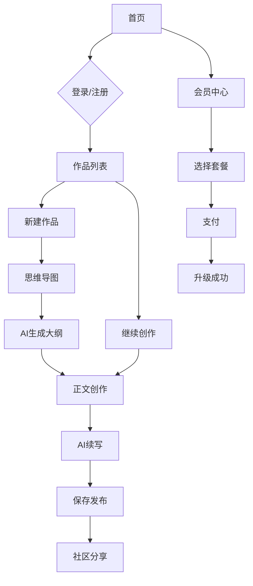

## 1. 产品概述
简单写作（simplechat）是一个AI驱动的网文小说创作平台，旨在为创作者提供智能化、结构化的写作工具。通过集成多种大语言模型和思维导图功能，帮助用户高效创作百万字级别的网络文学作品。

目标用户为网络文学创作者、业余写作者和内容创作者，解决传统写作中构思困难、情节断裂、创作效率低等问题。

## 2. 核心功能

### 2.1 用户角色
| 角色 | 注册方式 | 核心权限 |
|------|----------|----------|
| 免费用户 | 手机号+验证码/邮箱+密码 | 基础AI模型、有限字数、基础思维导图 |
| Pro会员 | 付费升级（月/季/年） | 高级AI模型、更多字数、完整功能、社区特权 |
| Max会员 | 付费升级（年费） | 顶级AI模型、无限制字数、全部功能、专属客服 |

### 2.2 功能模块
核心页面包括：
1. **首页**：作品列表、创作入口、会员状态
2. **创作工作台**：思维导图编辑器、正文编辑器、AI辅助面板
3. **作品管理**：章节列表、大纲管理、角色设定、世界设定
4. **社区中心**：作品分享、交流讨论、教程学习
5. **个人中心**：账户设置、会员管理、创作统计

### 2.3 页面详情
| 页面名称 | 模块名称 | 功能描述 |
|----------|----------|----------|
| 首页 | 导航栏 | 显示logo、用户信息、消息通知 |
| 首页 | 作品列表 | 展示用户所有作品、创作状态、进度统计 |
| 首页 | 快速创作 | 新建作品、选择模板、AI辅助创作 |
| 创作工作台 | 左侧边栏 | 作品大纲、世界设定、角色塑造、事件细纲 |
| 创作工作台 | 思维导图 | 可视化编辑节点、拖拽操作、AI生成子节点 |
| 创作工作台 | 正文编辑器 | 富文本编辑、字数统计、版本历史、AI续写 |
| 创作工作台 | 右侧面板 | AI建议、章节列表、创作提示 |
| 作品管理 | 章节管理 | 增删改查章节、排序、导出 |
| 作品管理 | 大纲编辑 | 结构化编辑故事主线、分支剧情 |
| 作品管理 | 角色管理 | 创建角色档案、关系图谱、性格设定 |
| 作品管理 | 世界设定 | 构建世界观、规则体系、背景故事 |
| 社区中心 | 作品广场 | 浏览他人作品、点赞评论、收藏 |
| 社区中心 | 创作交流 | 发帖讨论、问答互助、经验分享 |
| 社区中心 | 教程专区 | 写作技巧、AI使用指南、视频教程 |
| 个人中心 | 账户设置 | 修改资料、绑定手机/邮箱、密码管理 |
| 个人中心 | 会员中心 | 会员状态、充值续费、消费记录 |
| 个人中心 | 创作统计 | 字数统计、作品数量、AI使用次数 |

## 3. 核心流程
### 用户创作流程
1. 注册登录 → 选择会员等级 → 进入创作工作台
2. 新建作品 → 使用思维导图制定大纲 → AI生成世界观/角色/事件
3. 开始正文创作 → AI辅助续写 → 保存章节 → 发布分享

### 会员购买流程
浏览会员权益 → 选择套餐（月/季/年） → 支付 → 解锁高级功能

## 4. 用户界面设计

### 4.1 设计风格
- **主色调**：深蓝灰（#1a1a2e）+ 纯白背景
- **辅助色**：科技蓝（#4a90e2）、活力橙（#ff6b35）
- **按钮样式**：圆角矩形，悬停动效，主要操作用主色
- **字体**：中文-思源黑体，英文-Inter，正文字号14-16px
- **布局**：左侧固定边栏（240px）+ 中间内容区 + 右侧辅助面板
- **图标**：线性图标，简洁现代风格

### 4.2 页面设计概览
| 页面名称 | 模块名称 | UI元素 |
|----------|----------|--------|
| 首页 | 导航栏 | Logo居中，用户头像右上角，消息铃铛图标 |
| 首页 | 作品卡片 | 网格布局，显示封面、标题、进度条、字数统计 |
| 创作工作台 | 思维导图 | 深色背景，蓝色节点，白色文字，支持拖拽缩放 |
| 创作工作台 | 正文编辑器 | 白色背景，工具栏置顶，仿专业写作软件界面 |
| 创作工作台 | AI面板 | 卡片式设计，淡紫色按钮，显示模型选择和生成内容 |
| 社区中心 | 作品广场 | 瀑布流布局，卡片hover效果，点赞评论图标 |
| 个人中心 | 设置页面 | 表单分组，开关组件，保存按钮底部固定 |

### 4.3 响应式设计
- **桌面端优先**：1440px以上最佳体验
- **平板适配**：768px-1439px，侧边栏可收起
- **移动端**：375px-767px，底部导航替代侧边栏
- **触控优化**：移动端增大点击区域，支持手势操作

### 4.4 3D场景指导
不适用，本产品为2D界面设计。