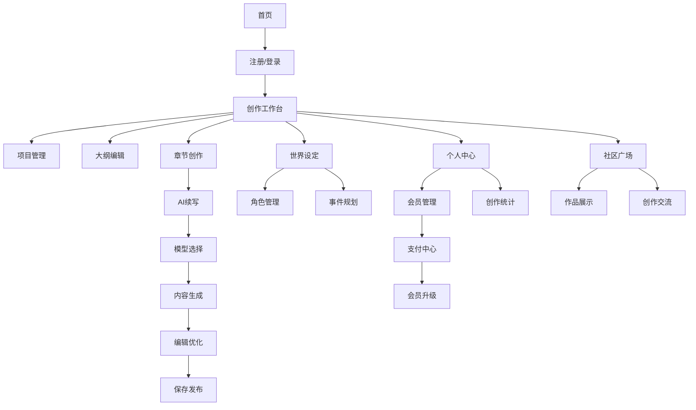

## 1. 产品概述

简单写作是一个面向C端用户的AI网文小说创作平台，支持用户选择不同的大模型进行长篇小说创作。通过智能上下文记忆和续写技术，解决AI模型在长文本创作中的上下文遗忘问题，帮助作者高效创作高质量网络小说。

产品主要解决传统写作效率低、灵感匮乏、长篇小说逻辑一致性难维护等痛点，为网文作者提供智能化的创作工具，降低创作门槛，提升写作效率和质量。

## 2. 核心功能

### 2.1 用户角色

| 角色 | 注册方式 | 核心权限 |
|------|----------|----------|
| 免费用户 | 邮箱/手机号注册 | 基础AI创作功能，每日使用限额 |
| 基础会员 | 付费升级 | 增强AI功能，更高使用限额，优先客服 |
| 专业会员 | 付费升级 | 全功能访问，无限制使用，高级AI模型 |
| 企业会员 | 商务合作 | 团队协作，API接入，定制化服务 |

### 2.2 功能模块

平台包含以下核心页面：

1. **首页**: 产品展示、功能介绍、价格方案、用户登录入口
2. **创作工作台**: 项目管理、大纲编辑、章节创作、AI续写
3. **世界设定管理**: 世界观构建、角色管理、时间线规划
4. **模型选择器**: AI模型对比、性能监控、调用记录
5. **个人中心**: 用户信息、会员管理、创作统计、账户设置
6. **支付中心**: 会员升级、充值记录、发票管理
7. **社区广场**: 作品展示、创作交流、使用教程

### 2.3 页面详情

| 页面名称 | 模块名称 | 功能描述 |
|----------|----------|----------|
| 首页 | 产品展示 | 展示平台核心功能和优势，包含轮播图和功能介绍 |
| 首页 | 价格方案 | 展示不同会员等级的功能和价格对比 |
| 首页 | 用户登录 | 提供邮箱/手机号登录入口，支持第三方登录 |
| 创作工作台 | 项目管理 | 创建、编辑、删除小说项目，支持项目分类和搜索 |
| 创作工作台 | 大纲编辑器 | 思维导图式大纲编辑，支持节点拖拽和层级管理 |
| 创作工作台 | 章节创作 | 富文本编辑器，支持AI续写、智能提示、版本历史 |
| 创作工作台 | AI续写面板 | 选择参考章节、设置续写参数、生成内容预览 |
| 世界设定管理 | 世界观构建 | 创建和管理小说世界观，包含规则体系和时间线 |
| 世界设定管理 | 角色管理 | 角色档案创建、关系图谱、成长轨迹记录 |
| 世界设定管理 | 事件规划 | 情节分支设计、时间轴排列、因果关系设定 |
| 模型选择器 | 模型对比 | 展示不同AI模型的性能指标、价格、适用场景 |
| 模型选择器 | 性能监控 | 实时显示模型响应时间、成功率、用户评分 |
| 模型选择器 | 调用记录 | 显示历史调用记录，包含使用时间、消耗额度 |
| 个人中心 | 用户信息 | 显示和编辑用户基本信息、头像、个人简介 |
| 个人中心 | 会员管理 | 查看当前会员状态、升级会员、管理自动续费 |
| 个人中心 | 创作统计 | 显示创作字数、使用次数、AI辅助效率等数据 |
| 个人中心 | 账户设置 | 修改密码、绑定邮箱/手机、设置通知偏好 |
| 支付中心 | 会员升级 | 选择会员套餐、支付方式、完成支付流程 |
| 支付中心 | 充值记录 | 查看历史充值记录、消费明细、余额查询 |
| 支付中心 | 发票管理 | 申请开具发票、查看发票历史、下载电子发票 |
| 社区广场 | 作品展示 | 用户作品展示墙，支持点赞、收藏、评论 |
| 社区广场 | 创作交流 | 论坛功能，支持发帖、回复、话题讨论 |
| 社区广场 | 使用教程 | 平台使用指南、AI创作技巧、视频教程 |

## 3. 核心流程

### 3.1 用户注册登录流程
用户访问首页 → 点击注册/登录 → 选择注册方式（邮箱/手机号）→ 填写验证信息 → 完成注册 → 进入创作工作台

### 3.2 小说创作流程
创建新项目 → 编辑故事大纲 → 设定世界观和角色 → 开始章节创作 → 使用AI续写功能 → 编辑和优化内容 → 保存和发布

### 3.3 AI续写流程
选择需要续写的章节 → 设置上下文范围 → 选择AI模型 → 配置生成参数 → 生成内容预览 → 编辑和调整 → 确认插入正文

### 3.4 会员升级流程
进入个人中心 → 点击升级会员 → 选择会员套餐 → 选择支付方式 → 完成支付 → 会员权益生效

## 4. 用户界面设计

### 4.1 设计风格
- **主色调**: 深蓝色（#1E3A8A）配白色背景，营造专业可信赖感
- **辅助色**: 浅灰色（#F3F4F6）用于背景，绿色（#10B981）用于成功状态
- **按钮样式**: 圆角矩形设计，主要按钮使用渐变色，次要按钮使用边框样式
- **字体选择**: 中文使用思源黑体，英文使用Inter，正文字号14-16px
- **布局风格**: 卡片式布局，左侧导航栏+右侧内容区的经典后台设计
- **图标风格**: 使用线性图标，保持简洁统一的视觉风格

### 4.2 页面设计概述

| 页面名称 | 模块名称 | UI元素 |
|----------|----------|--------|
| 首页 | 产品展示 | 全屏轮播图展示核心功能，使用渐变色背景和动态效果 |
| 首页 | 价格方案 | 三栏卡片布局，突出推荐方案，包含功能对比表格 |
| 创作工作台 | 项目管理 | 网格卡片展示项目，包含封面图、标题、进度条、操作按钮 |
| 创作工作台 | 大纲编辑器 | 左侧树形结构，右侧节点编辑面板，支持拖拽操作 |
| 创作工作台 | 章节创作 | 类Word编辑器界面，顶部工具栏，左侧章节列表 |
| 创作工作台 | AI续写面板 | 右侧滑出面板，包含参数设置和生成预览区域 |
| 世界设定管理 | 角色管理 | 角色卡片网格布局，支持头像、属性标签、关系连线 |
| 个人中心 | 会员管理 | 进度条显示当前等级，卡片展示会员权益对比 |
| 社区广场 | 作品展示 | Pinterest风格瀑布流布局，支持筛选和搜索 |

### 4.3 响应式设计
- **桌面端优先**: 以1440px宽度为基准设计，支持最大1920px宽屏显示
- **平板适配**: 768px-1024px宽度，采用折叠式导航栏，双列卡片布局
- **手机适配**: 375px-414px宽度，底部导航栏，单列卡片布局，手势操作优化
- **触控优化**: 按钮最小44px点击区域，支持滑动、捏合等手势操作

### 4.4 3D场景指导（角色关系图谱）
- **环境设置**: 使用简约的科技风格背景，深蓝色渐变配粒子效果
- **光照配置**: 三点光照系统，主光源强度0.8，补光0.4，轮廓光0.6
- **相机控制**: 45度俯视角，支持鼠标拖拽旋转和滚轮缩放
- **节点设计**: 角色节点使用圆形头像+名称标签，关系线使用贝塞尔曲线
- **交互效果**: 悬停高亮，点击展开详情，拖拽重新排列节点位置
- **性能优化**: 限制同时显示节点数量，使用LOD技术优化大规模关系图

## 5. 扩展功能

### 5.1 协作创作
- 支持多人实时编辑同一项目
- 提供评论和批注功能
- 版本控制和冲突解决机制

### 5.2 数据分析
- 写作效率统计（日/周/月）
- AI使用率分析
- 创作习惯洞察

### 5.3 导出发布
- 支持多种格式导出（TXT、PDF、EPUB）
- 一键发布到合作平台
- 版权保护和水印添加