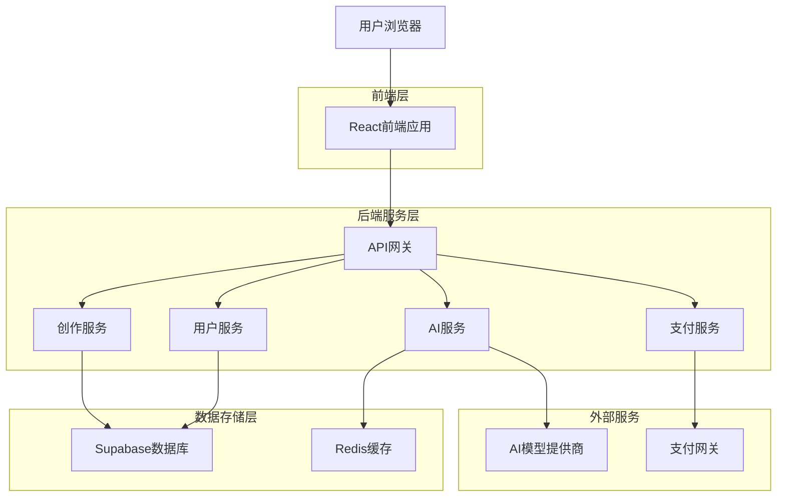
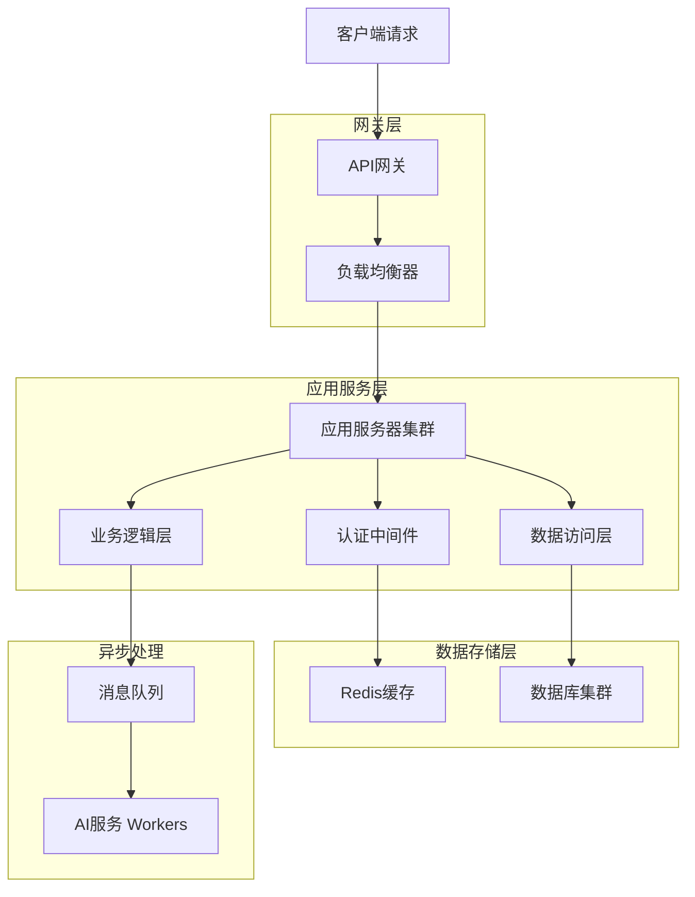
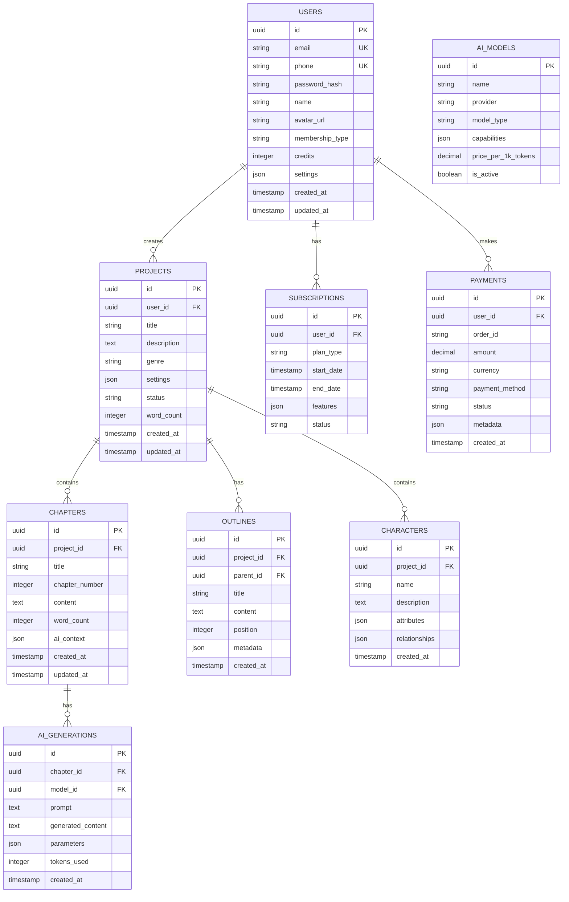

## 1. 架构设计



## 2. 技术描述

- **前端**: React@18 + TypeScript@5 + Tailwind CSS@3 + Vite@5
- **初始化工具**: vite-init
- **后端**: Node.js@20 + Express@4 + TypeScript@5
- **数据库**: Supabase (PostgreSQL@15)
- **缓存**: Redis@7
- **文件存储**: Supabase Storage
- **实时通信**: Socket.io@4
- **AI集成**: OpenAI API、Claude API、文心一言API
- **支付**: 支付宝SDK、微信支付SDK、Stripe

## 3. 路由定义

| 路由 | 用途 |
|------|------|
| / | 首页，产品展示和功能介绍 |
| /login | 登录页面，支持邮箱/手机号登录 |
| /register | 注册页面，支持邮箱/手机号注册 |
| /dashboard | 创作工作台，项目管理和创作入口 |
| /project/:id | 项目详情页，包含大纲和章节编辑 |
| /write/:id | 写作页面，富文本编辑器和AI续写 |
| /world-building | 世界设定管理，角色和世界观编辑 |
| /ai-models | AI模型选择器，模型对比和选择 |
| /profile | 个人中心，用户信息和设置 |
| /membership | 会员管理，升级和权益查看 |
| /payment | 支付中心，充值和订单管理 |
| /community | 社区广场，作品展示和交流 |
| /settings | 系统设置，偏好和账户安全 |

## 4. API定义

### 4.1 用户认证API

**用户注册**
```
POST /api/auth/register
```

请求参数：
| 参数名 | 类型 | 必填 | 描述 |
|--------|------|------|------|
| email | string | 是 | 邮箱地址 |
| phone | string | 否 | 手机号（邮箱和手机号二选一）|
| password | string | 是 | 密码（8-32位）|
| verification_code | string | 是 | 验证码 |

响应：
```json
{
  "success": true,
  "data": {
    "user_id": "uuid",
    "token": "jwt_token",
    "expires_in": 86400
  }
}
```

**用户登录**
```
POST /api/auth/login
```

请求参数：
| 参数名 | 类型 | 必填 | 描述 |
|--------|------|------|------|
| email | string | 否 | 邮箱地址 |
| phone | string | 否 | 手机号 |
| password | string | 是 | 密码 |

### 4.2 项目管理API

**创建项目**
```
POST /api/projects
```

请求参数：
| 参数名 | 类型 | 必填 | 描述 |
|--------|------|------|------|
| title | string | 是 | 项目标题 |
| description | string | 否 | 项目描述 |
| genre | string | 是 | 小说类型 |
| template_id | string | 否 | 模板ID |

**获取项目列表**
```
GET /api/projects?page=1&limit=10&status=all
```

### 4.3 AI创作API

**AI续写**
```
POST /api/ai/continue-writing
```

请求参数：
| 参数名 | 类型 | 必填 | 描述 |
|--------|------|------|------|
| project_id | string | 是 | 项目ID |
| chapter_id | string | 是 | 章节ID |
| context_range | object | 是 | 上下文范围 |
| model_id | string | 是 | AI模型ID |
| parameters | object | 否 | 生成参数 |

**模型列表**
```
GET /api/ai/models
```

### 4.4 支付API

**创建订单**
```
POST /api/payment/create-order
```

请求参数：
| 参数名 | 类型 | 必填 | 描述 |
|--------|------|------|------|
| product_id | string | 是 | 产品ID |
| payment_method | string | 是 | 支付方式 |
| amount | number | 是 | 金额 |

## 5. 服务器架构



## 6. 数据模型

### 6.1 数据模型定义



### 6.2 数据定义语言

**用户表**
```sql
CREATE TABLE users (
    id UUID PRIMARY KEY DEFAULT gen_random_uuid(),
    email VARCHAR(255) UNIQUE,
    phone VARCHAR(20) UNIQUE,
    password_hash VARCHAR(255) NOT NULL,
    name VARCHAR(100) NOT NULL,
    avatar_url TEXT,
    membership_type VARCHAR(20) DEFAULT 'free',
    credits INTEGER DEFAULT 0,
    settings JSONB DEFAULT '{}',
    created_at TIMESTAMP WITH TIME ZONE DEFAULT NOW(),
    updated_at TIMESTAMP WITH TIME ZONE DEFAULT NOW()
);

CREATE INDEX idx_users_email ON users(email);
CREATE INDEX idx_users_phone ON users(phone);
```

**项目表**
```sql
CREATE TABLE projects (
    id UUID PRIMARY KEY DEFAULT gen_random_uuid(),
    user_id UUID NOT NULL REFERENCES users(id) ON DELETE CASCADE,
    title VARCHAR(255) NOT NULL,
    description TEXT,
    genre VARCHAR(50),
    settings JSONB DEFAULT '{}',
    status VARCHAR(20) DEFAULT 'active',
    word_count INTEGER DEFAULT 0,
    created_at TIMESTAMP WITH TIME ZONE DEFAULT NOW(),
    updated_at TIMESTAMP WITH TIME ZONE DEFAULT NOW()
);

CREATE INDEX idx_projects_user_id ON projects(user_id);
CREATE INDEX idx_projects_created_at ON projects(created_at DESC);
```

**章节表**
```sql
CREATE TABLE chapters (
    id UUID PRIMARY KEY DEFAULT gen_random_uuid(),
    project_id UUID NOT NULL REFERENCES projects(id) ON DELETE CASCADE,
    title VARCHAR(255) NOT NULL,
    chapter_number INTEGER,
    content TEXT,
    word_count INTEGER DEFAULT 0,
    ai_context JSONB DEFAULT '{}',
    created_at TIMESTAMP WITH TIME ZONE DEFAULT NOW(),
    updated_at TIMESTAMP WITH TIME ZONE DEFAULT NOW()
);

CREATE INDEX idx_chapters_project_id ON chapters(project_id);
CREATE INDEX idx_chapters_chapter_number ON chapters(chapter_number);
```

**AI模型表**
```sql
CREATE TABLE ai_models (
    id UUID PRIMARY KEY DEFAULT gen_random_uuid(),
    name VARCHAR(100) NOT NULL,
    provider VARCHAR(50) NOT NULL,
    model_type VARCHAR(50),
    capabilities JSONB DEFAULT '{}',
    price_per_1k_tokens DECIMAL(10,6),
    is_active BOOLEAN DEFAULT true,
    created_at TIMESTAMP WITH TIME ZONE DEFAULT NOW()
);

INSERT INTO ai_models (name, provider, model_type, price_per_1k_tokens) VALUES
('GPT-4', 'OpenAI', 'gpt-4', 0.03),
('GPT-3.5 Turbo', 'OpenAI', 'gpt-3.5-turbo', 0.002),
('Claude-2', 'Anthropic', 'claude-2', 0.025),
('文心一言', 'Baidu', 'ernie-bot', 0.015);
```

## 7. 性能优化

### 7.1 缓存策略
- **Redis缓存**: 用户会话、热点数据、AI模型响应缓存
- **CDN加速**: 静态资源、用户头像、模板文件
- **数据库优化**: 索引优化、查询优化、连接池管理

### 7.2 高并发处理
- **负载均衡**: Nginx + 多实例部署
- **消息队列**: Redis Pub/Sub + Bull Queue
- **限流机制**: 基于用户等级的API调用频率限制

### 7.3 文本处理优化
- **分片处理**: 大文本分块处理，支持流式响应
- **向量搜索**: 使用pgvector进行语义搜索
- **压缩存储**: 文本内容压缩存储，节省空间

## 8. 安全设计

### 8.1 数据安全
- **加密存储**: 用户密码bcrypt加密，敏感信息AES加密
- **访问控制**: 基于角色的权限管理（RBAC）
- **数据备份**: 定期自动备份，支持点对点恢复

### 8.2 API安全
- **JWT认证**: 无状态认证机制
- **HTTPS传输**: 全站SSL加密
- **输入验证**: 严格的参数验证和SQL注入防护

### 8.3 隐私保护
- **数据脱敏**: 用户隐私信息脱敏处理
- **审计日志**: 完整的操作日志记录
- **GDPR合规**: 支持用户数据导出和删除

## 9. 监控运维

### 9.1 系统监控
- **应用监控**: PM2 + 自定义指标
- **数据库监控**: PostgreSQL性能指标
- **服务器监控**: CPU、内存、磁盘、网络

### 9.2 日志管理
- **结构化日志**: Winston + JSON格式
- **日志收集**: ELK Stack (Elasticsearch + Logstash + Kibana)
- **错误追踪**: Sentry集成

### 9.3 告警机制
- **多渠道告警**: 邮件、短信、企业微信
- **智能降噪**: 告警聚合和降噪处理
- **自动恢复**: 关键服务自动重启机制