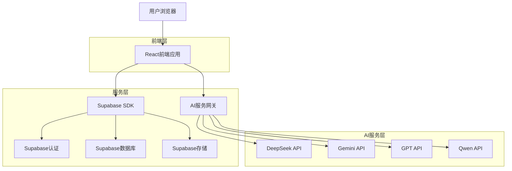
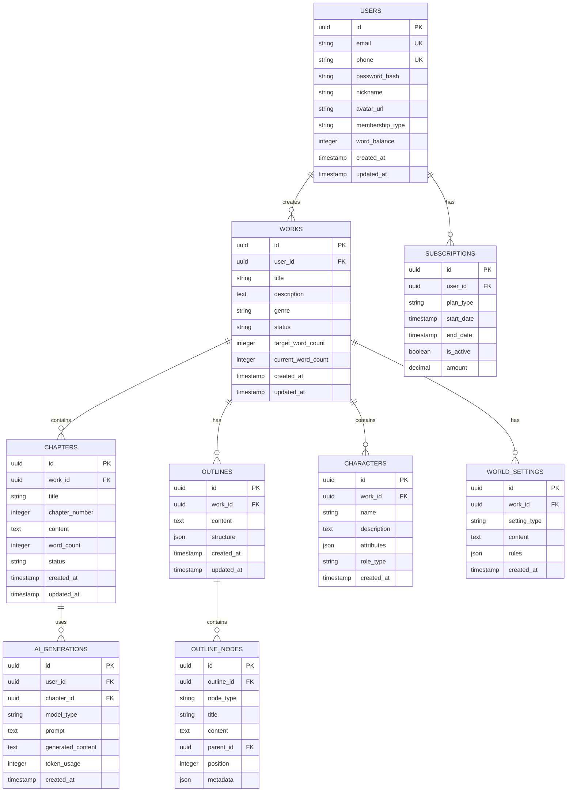

## 1. 架构设计



## 2. 技术栈描述

- **前端**: React@18 + TypeScript + TailwindCSS@3 + Vite
- **初始化工具**: vite-init
- **后端**: Supabase (BaaS)
- **数据库**: PostgreSQL (通过Supabase)
- **认证**: Supabase Auth
- **存储**: Supabase Storage
- **状态管理**: Zustand
- **路由**: React Router@6
- **UI组件**: HeadlessUI + Radix UI
- **富文本编辑器**: TipTap
- **思维导图**: React Flow
- **图表可视化**: Mermaid + Chart.js

## 3. 路由定义

| 路由 | 用途 |
|------|------|
| / | 首页，作品列表和快速入口 |
| /login | 登录页面，支持手机号和邮箱登录 |
| /register | 注册页面，验证码验证 |
| /dashboard | 用户仪表板，创作统计 |
| /workspace/:id | 创作工作台，思维导图和编辑器 |
| /outline/:id | 作品大纲管理 |
| /character/:id | 角色设定管理 |
| /world/:id | 世界观设定 |
| /community | 创作社区 |
| /profile | 个人资料和设置 |
| /membership | 会员中心和充值 |
| /tutorial | 教程中心 |

## 4. API定义

### 4.1 认证相关API

```typescript
// 用户注册
POST /api/auth/register
{
  "email": string,
  "phone"?: string,
  "password": string,
  "verification_code": string
}

// 用户登录
POST /api/auth/login
{
  "email"?: string,
  "phone"?: string,
  "password"?: string,
  "verification_code"?: string
}

// 获取用户信息
GET /api/auth/user
```

### 4.2 作品管理API

```typescript
// 创建作品
POST /api/works
{
  "title": string,
  "description"?: string,
  "genre": string,
  "target_word_count": number
}

// 获取作品列表
GET /api/works

// 更新作品信息
PUT /api/works/:id
{
  "title"?: string,
  "description"?: string,
  "status": "draft" | "ongoing" | "completed"
}
```

### 4.3 AI创作API

```typescript
// 生成大纲
POST /api/ai/outline
{
  "work_id": string,
  "prompt": string,
  "model": "deepseek" | "gemini" | "gpt" | "qwen",
  "node_id"?: string
}

// 续写内容
POST /api/ai/continue
{
  "work_id": string,
  "chapter_id": string,
  "context": string,
  "model": string,
  "word_count": number
}

// 优化文本
POST /api/ai/optimize
{
  "text": string,
  "style": "vivid" | "concise" | "literary",
  "model": string
}
```

## 5. 数据模型

### 5.1 数据库ER图



### 5.2 数据定义语言

```sql
-- 用户表
CREATE TABLE users (
    id UUID PRIMARY KEY DEFAULT gen_random_uuid(),
    email VARCHAR(255) UNIQUE,
    phone VARCHAR(20) UNIQUE,
    password_hash VARCHAR(255) NOT NULL,
    nickname VARCHAR(100) NOT NULL,
    avatar_url TEXT,
    membership_type VARCHAR(20) DEFAULT 'free' CHECK (membership_type IN ('free', 'pro', 'max')),
    word_balance INTEGER DEFAULT 0,
    created_at TIMESTAMP WITH TIME ZONE DEFAULT NOW(),
    updated_at TIMESTAMP WITH TIME ZONE DEFAULT NOW()
);

-- 作品表
CREATE TABLE works (
    id UUID PRIMARY KEY DEFAULT gen_random_uuid(),
    user_id UUID REFERENCES users(id) ON DELETE CASCADE,
    title VARCHAR(255) NOT NULL,
    description TEXT,
    genre VARCHAR(50),
    status VARCHAR(20) DEFAULT 'draft' CHECK (status IN ('draft', 'ongoing', 'completed')),
    target_word_count INTEGER DEFAULT 0,
    current_word_count INTEGER DEFAULT 0,
    created_at TIMESTAMP WITH TIME ZONE DEFAULT NOW(),
    updated_at TIMESTAMP WITH TIME ZONE DEFAULT NOW()
);

-- 章节表
CREATE TABLE chapters (
    id UUID PRIMARY KEY DEFAULT gen_random_uuid(),
    work_id UUID REFERENCES works(id) ON DELETE CASCADE,
    title VARCHAR(255) NOT NULL,
    chapter_number INTEGER NOT NULL,
    content TEXT,
    word_count INTEGER DEFAULT 0,
    status VARCHAR(20) DEFAULT 'draft',
    created_at TIMESTAMP WITH TIME ZONE DEFAULT NOW(),
    updated_at TIMESTAMP WITH TIME ZONE DEFAULT NOW()
);

-- 大纲节点表
CREATE TABLE outline_nodes (
    id UUID PRIMARY KEY DEFAULT gen_random_uuid(),
    outline_id UUID REFERENCES works(id) ON DELETE CASCADE,
    node_type VARCHAR(50) NOT NULL,
    title VARCHAR(255) NOT NULL,
    content TEXT,
    parent_id UUID REFERENCES outline_nodes(id),
    position INTEGER DEFAULT 0,
    metadata JSONB,
    created_at TIMESTAMP WITH TIME ZONE DEFAULT NOW()
);

-- AI生成记录表
CREATE TABLE ai_generations (
    id UUID PRIMARY KEY DEFAULT gen_random_uuid(),
    user_id UUID REFERENCES users(id) ON DELETE CASCADE,
    chapter_id UUID REFERENCES chapters(id) ON DELETE CASCADE,
    model_type VARCHAR(50) NOT NULL,
    prompt TEXT NOT NULL,
    generated_content TEXT,
    token_usage INTEGER DEFAULT 0,
    created_at TIMESTAMP WITH TIME ZONE DEFAULT NOW()
);

-- 创建索引
CREATE INDEX idx_users_email ON users(email);
CREATE INDEX idx_users_phone ON users(phone);
CREATE INDEX idx_works_user_id ON works(user_id);
CREATE INDEX idx_chapters_work_id ON chapters(work_id);
CREATE INDEX idx_outline_nodes_outline_id ON outline_nodes(outline_id);
CREATE INDEX idx_ai_generations_user_id ON ai_generations(user_id);
CREATE INDEX idx_ai_generations_created_at ON ai_generations(created_at DESC);

-- Supabase RLS策略
-- 用户只能查看和编辑自己的数据
ALTER TABLE users ENABLE ROW LEVEL SECURITY;
ALTER TABLE works ENABLE ROW LEVEL SECURITY;
ALTER TABLE chapters ENABLE ROW LEVEL SECURITY;
ALTER TABLE ai_generations ENABLE ROW LEVEL SECURITY;

-- 用户表策略
CREATE POLICY "用户可查看自己的资料" ON users FOR SELECT USING (auth.uid() = id);
CREATE POLICY "用户可更新自己的资料" ON users FOR UPDATE USING (auth.uid() = id);

-- 作品表策略
CREATE POLICY "用户可查看自己的作品" ON works FOR SELECT USING (auth.uid() = user_id);
CREATE POLICY "用户可创建自己的作品" ON works FOR INSERT WITH CHECK (auth.uid() = user_id);
CREATE POLICY "用户可更新自己的作品" ON works FOR UPDATE USING (auth.uid() = user_id);
CREATE POLICY "用户可删除自己的作品" ON works FOR DELETE USING (auth.uid() = user_id);

-- 权限授予
GRANT SELECT ON users TO anon;
GRANT ALL ON users TO authenticated;
GRANT SELECT ON works TO anon;
GRANT ALL ON works TO authenticated;
GRANT SELECT ON chapters TO anon;
GRANT ALL ON chapters TO authenticated;
GRANT SELECT ON ai_generations TO anon;
GRANT ALL ON ai_generations TO authenticated;
```

## 6. 部署配置

### 6.1 Vercel部署配置

```json
{
  "version": 2,
  "builds": [
    {
      "src": "package.json",
      "use": "@vercel/static-build",
      "config": {
        "distDir": "dist"
      }
    }
  ],
  "routes": [
    {
      "src": "/(.*)",
      "dest": "/index.html"
    }
  ],
  "env": {
    "VITE_SUPABASE_URL": "@supabase-url",
    "VITE_SUPABASE_ANON_KEY": "@supabase-anon-key",
    "VITE_DEEPSEEK_API_KEY": "@deepseek-api-key",
    "VITE_GEMINI_API_KEY": "@gemini-api-key"
  }
}
```

### 6.2 环境变量配置

```bash
# 开发环境
VITE_SUPABASE_URL=https://your-project.supabase.co
VITE_SUPABASE_ANON_KEY=your-anon-key
VITE_DEEPSEEK_API_KEY=your-deepseek-key
VITE_GEMINI_API_KEY=your-gemini-key
VITE_GPT_API_KEY=your-gpt-key
VITE_QWEN_API_KEY=your-qwen-key

# 生产环境
VITE_APP_URL=https://simplechat.vercel.app
VITE_API_BASE_URL=https://api.simplechat.com
```